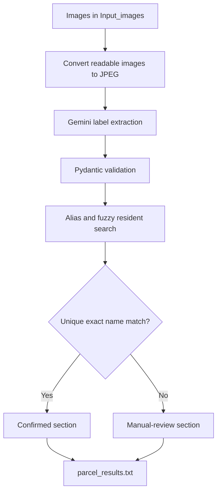

# RA Parcel Scanner

RA Parcel Scanner is a Python prototype for processing parcel-label images in batches. It uses Gemini to extract the recipient and room information, compares the detected name with a local resident directory, and produces a text report for Resident Adviser review.

The report lists unique 100% name matches first. Fuzzy matches, duplicate names, unreadable labels, and processing errors are placed in a manual-review section at the bottom.

> **Status:** Early prototype. It processes saved images from a folder and does not yet provide live camera capture or automatically search StarRez.

## How it works



1. `main.py` reads every file in `Input_images/`.
2. Images that are not already JPG files are converted and stored in `Converted_images/`.
3. `image_reader.py` sends each JPEG to Gemini.
4. Gemini extracts the recipient name, room details, address, tracking number, and confidence.
5. Pydantic validates the structured response.
6. `csv_search.py` compares the detected name against the resident's accepted aliases.
7. Detected building, room number, and room letter are used as additional ranking evidence when available.
8. `main.py` writes the complete batch result to `output_lists/parcel_results.txt`.

## Features

- Batch processing from `Input_images/`
- HEIC and HEIF support for iPhone photos
- Conversion of Pillow-compatible images to JPEG
- EXIF orientation correction
- Safe handling of transparent images
- Structured Gemini output validated with Pydantic
- Preferred-name, legal-name, and alias matching
- RapidFuzz comparison for OCR and spelling differences
- Optional building, room-number, room-letter, and phone evidence in the search function
- Unique exact matches separated from results requiring manual review
- Student ID, resident name, room, building, and phone retrieval
- One predictable text report per scan run
- Automatic deletion of the original HEIC or HEIF only after successful processing

## Technology

- Python
- Google Gen AI SDK
- Gemini 3.5 Flash-Lite
- Pydantic
- pandas
- RapidFuzz
- Pillow
- pillow-heif

## Project structure

```text
RA-parcel-scanner/
├── Input_images/                         # Parcel images waiting to be processed
├── Converted_images/                     # Generated JPEG versions
├── output_lists/
│   └── parcel_results.txt                # Generated batch report
├── main.py                               # Batch processing and report creation
├── image_reader.py                       # Gemini extraction and validation
├── csv_search.py                         # Resident matching and ranking
├── test.py                               # Development test script
├── residents_lookup_enriched_no_spaces.csv  # Local resident directory
└── .gitignore                            # Prevents private data from being committed
```

The image, resident-data, converted-image, and output directories are local and ignored by Git.

## Setup

### 1. Clone the repository

```bash
git clone https://github.com/Zelandini/RA-parcel-scanner.git
cd RA-parcel-scanner
```

If the current changes are still in the draft pull request, check out its branch:

```bash
git checkout agent/output-match-report
```

### 2. Create a virtual environment

macOS or Linux:

```bash
python3 -m venv .venv
source .venv/bin/activate
```

Windows PowerShell:

```powershell
python -m venv .venv
.venv\Scripts\Activate.ps1
```

### 3. Install dependencies

```bash
pip install google-genai pydantic pandas rapidfuzz Pillow pillow-heif
```

### 4. Configure the Gemini API key

Create a Gemini API key in [Google AI Studio](https://aistudio.google.com/app/apikey).

macOS or Linux:

```bash
export GEMINI_API_KEY="your_api_key_here"
```

Windows PowerShell:

```powershell
$env:GEMINI_API_KEY="your_api_key_here"
```

Do not place the API key directly in the source code or commit it to GitHub.

### 5. Prepare the resident lookup CSV

Place the following file in the project directory:

```text
residents_lookup_enriched_no_spaces.csv
```

The search code uses these columns:

```csv
student_id,full_name,legal_full_name,search_name,legal_search_name,search_aliases,phone_number,room,room_short,building
123456789,Alex Example,Alexander Example,alex example,alexander example,alex example|alexander example,0211234567,831-105B,105B,831
```

`search_aliases` contains normalized names separated by `|`. It can contain preferred, legal, and other accepted versions of the resident's name.

### 6. Add parcel images

Create the input directory if it does not exist:

```bash
mkdir Input_images
```

Place the parcel images inside it:

```text
Input_images/
├── parcel_001.heic
├── parcel_002.jpg
└── parcel_003.png
```

The program attempts to open any format supported by Pillow and `pillow-heif`. Files it cannot recognise are reported as errors without stopping the rest of the batch.

### 7. Run the scanner

```bash
python main.py
```

After processing, open:

```text
output_lists/parcel_results.txt
```

The report is replaced each time `main.py` runs.

## Example report

```text
PARCEL RESIDENT MATCHES
Generated: 2026-08-17 18:45:14 NZST

CONFIRMED 100% MATCHES
Student ID | Name | Room Number
------------------------------------------------------------------------
123456789 | Alex Example | 831-105B

UNSURE OR NOT FOUND — MANUAL REVIEW REQUIRED
------------------------------------------------------------------------
Image: parcel_002.jpg
Detected name: Alx Example
Status: Unsure
Reason: The best name match is below 100%.
Best candidate: 123456789 | Alex Example | 831-105B | 96.0%
```

## Resident matching

### Name aliases

The detected recipient name is compared with every alias in `search_aliases`. If that column is empty, the search falls back to `search_name`, `legal_search_name`, `full_name`, and `legal_full_name`.

RapidFuzz uses both `fuzz.ratio()` and `fuzz.token_sort_ratio()`. A resident must currently score at least 65 to remain a possible candidate.

### Confirmed match

A result is placed in the confirmed section only when:

- The detected name exactly matches an accepted resident alias.
- The name similarity is 100%.
- Exactly one resident has that exact match.

If multiple residents share the same exact name, the result remains unsure.

### Additional evidence

When Gemini detects them, the following fields adjust candidate ranking:

- Building number
- Room number
- Room letter

`search_csv()` can also accept a phone number, but the current Gemini extraction does not extract or pass a recipient phone number.

Additional evidence helps rank possible candidates. It does not turn a fuzzy name into a confirmed 100% name match.

### Manual review

The bottom section contains:

- Fuzzy matches below 100%
- Duplicate exact names
- Recipient names that cannot be found
- Labels where no recipient name was detected
- Image conversion failures
- Gemini, validation, or other processing errors

## Image handling

- Existing `.jpg` files are processed directly.
- Other readable formats are converted into `Converted_images/`.
- Animated images use their first frame.
- Phone-camera orientation is corrected using EXIF metadata.
- Transparent images receive a white background before JPEG conversion.
- Original HEIC and HEIF files are deleted only after conversion and parcel processing succeed.
- Other original image formats are retained.

## Privacy and security

This project can process names, addresses, student IDs, room numbers, phone numbers, tracking numbers, and parcel images.

- Use fake, personal, or properly authorised data during development.
- Never commit the resident lookup CSV.
- Never commit genuine parcel-label images.
- Never commit generated reports.
- Never commit API keys or `.env` files.
- Keep resident data only for as long as operationally necessary.
- Follow university and accommodation privacy requirements.
- Manually verify a result before taking action in StarRez or another resident system.

The included `.gitignore` excludes resident CSVs, parcel images, converted images, generated reports, virtual environments, and environment files. Files committed before the ignore rules were added remain tracked until they are removed from Git history or the repository.

## Current limitations

- No live camera or webcam capture
- No automatic label cropping or image-quality check
- No automatic StarRez search or update
- Phone matching is available in the search function but is not connected to Gemini extraction
- Matching thresholds require testing against a larger, authorised parcel dataset
- Gemini confidence and room evidence do not override the exact-name confirmation rule
- Human verification is still required before acting on a result

## Possible next steps

- Add live camera capture
- Add automatic label detection, cropping, and sharpness checks
- Extract recipient phone numbers when clearly visible
- Display all three possible candidates in the report
- Add a desktop or web interface
- Add anonymous accuracy and response-time measurements
- Add automated tests for matching, image handling, and report generation
- Move filenames, thresholds, and the Gemini model into configuration

## Disclaimer

This is an experimental workflow-assistance tool. Its output may be incorrect and must not be treated as authoritative without human verification.
