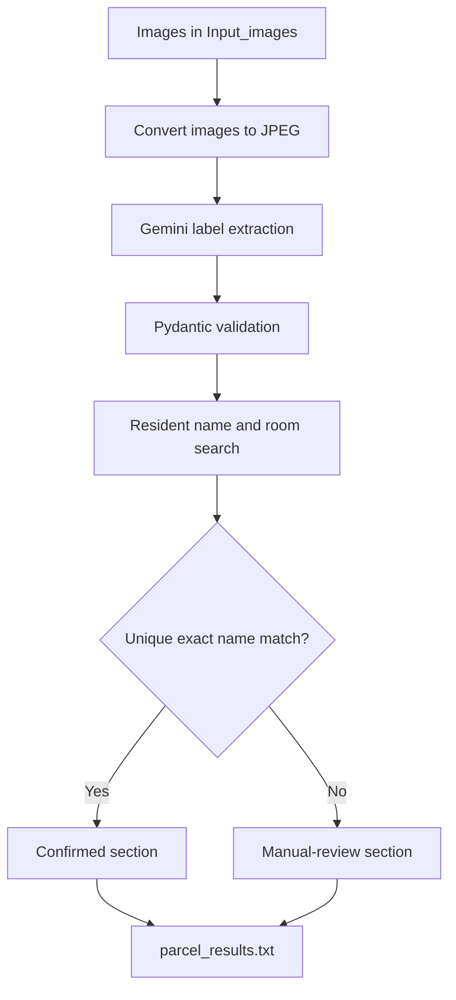

# RA Parcel Scanner

RA Parcel Scanner is a Python prototype that processes parcel-label images, identifies the intended recipients using Gemini, matches them against a local resident directory, and generates a list containing their student IDs, names, and room numbers.

The program processes multiple parcel images in one batch. Unique 100% name matches appear at the top of the generated report, while fuzzy matches, duplicate names, unreadable labels, and processing errors are placed in a manual-review section at the bottom.

> **Project status:** Local prototype. The scanner currently runs on one computer and processes saved images rather than using a live camera or shared web interface.

## Why I Built This

I created the RA Parcel Scanner because I am always looking for ways to make repetitive administrative work more efficient.

As a Resident Adviser, one of my responsibilities involves processing parcels delivered to the accommodation building. The existing process requires us to:

1. Read and manually write down the recipient’s name from each parcel.
2. Search for that resident in our database.
3. Find the correct student record.
4. Select the resident in StarRez.
5. Send them an email notifying them that their parcel has arrived.

The University of Auckland’s accommodation community includes residents from many different countries, cultures, and backgrounds. As a result, we regularly encounter names and spellings that may be unfamiliar to us.

When names are copied manually from parcel labels, even a small spelling mistake can make the resident difficult to find in the database. This often means returning to the parcel, checking the label again, rewriting the name, and repeating the search.

Sometimes the name printed on the parcel is also different from the resident’s preferred name in the database. In other cases, the recipient may no longer appear in the current resident list.

The RA Parcel Scanner reduces this repetitive work by:

* Reading the parcel label.
* Identifying the intended recipient.
* Comparing the detected name against preferred, legal, and alternative resident names.
* Retrieving the resident’s student ID and room number.
* Separating reliable matches from results requiring manual review.

Instead of manually searching for every resident by name, an RA can use the student ID produced by the scanner. Student IDs are unique, which makes it easier to find the correct student in StarRez, confirm the record, and send the parcel notification.

The goal is not to remove human verification. The goal is to make the repetitive part of the process faster, reduce transcription errors, and make uncertain results easier to review.

## Current Limitation

The current version is a local prototype. It can only be run from my laptop and requires:

* Python
* The required Python dependencies
* A Gemini API key
* A local copy of the resident lookup CSV
* Access to the project files

Although the scanner improves my own parcel-processing workflow, it is not yet accessible to the other Resident Advisers who perform the same administrative work.

## Planned Web Application

The next stage of this project is to turn the scanner into a secure web application that can be used by the wider Resident Adviser team.

The proposed workflow would be:

1. An authorised Resident Adviser signs in to the web application.
2. The RA uploads images of the parcels that have arrived.
3. The application processes the images and extracts the recipient information.
4. It compares each recipient against the resident directory.
5. Unique 100% matches are separated from uncertain or missing results.
6. The RA reviews any results requiring manual confirmation.
7. The application generates a TXT file containing the confirmed residents’ names, student IDs, and room numbers.
8. The RA downloads the report or receives a secure notification when it is ready.
9. The student IDs can then be copied into StarRez to find the correct residents and send parcel notifications.

This would allow multiple Resident Advisers to use the scanner without installing Python, downloading the project, or running it from my laptop.

I may also explore emailing the completed report to the RA who uploaded the images. However, because the report contains personal information such as student IDs and room numbers, a safer approach may be to email a notification containing a secure link rather than attaching the TXT file directly.

The long-term goal is to create a simple and accessible tool where RAs can upload parcel images, review the results, and obtain a ready-to-use list of student IDs. Human verification would remain part of the workflow, particularly for fuzzy, duplicate, or otherwise uncertain matches.

## How It Works



1. `main.py` reads every file inside `Input_images/`.
2. Images that are not already JPG files are converted and stored in `Converted_images/`.
3. `image_reader.py` sends each JPEG to Gemini.
4. Gemini extracts the recipient name, room details, address, tracking number, and confidence.
5. Pydantic validates the structured Gemini response.
6. `csv_search.py` compares the detected recipient name against the resident directory.
7. Detected building, room number, and room letter are used as additional ranking evidence when available.
8. Each result is classified as confirmed, unsure, not found, or an error.
9. `main.py` writes the complete result to `output_lists/parcel_results.txt`.

## Features

* Batch processing of parcel images
* Gemini-powered parcel-label analysis
* Structured output validated with Pydantic
* HEIC and HEIF support for iPhone photos
* Conversion of Pillow-compatible images to JPEG
* Automatic phone-camera orientation correction
* Safe handling of transparent images
* Preferred-name, legal-name, and alternative-name matching
* RapidFuzz matching for OCR and spelling differences
* Building, room-number, and room-letter evidence
* Optional phone-number matching inside the CSV search
* Unique 100% matches separated from uncertain results
* Student ID, name, room, building, and phone retrieval
* One TXT report generated for each batch
* HEIC and HEIF originals deleted only after successful processing
* Manual-review section for uncertain or failed results

## Technology

* Python
* Google Gen AI SDK
* Gemini 3.5 Flash-Lite
* Pydantic
* pandas
* RapidFuzz
* Pillow
* pillow-heif

## Project Structure

```text
RA-parcel-scanner/
├── Input_images/                            # Parcel images waiting to be processed
├── Converted_images/                        # Generated JPEG versions
├── output_lists/
│   └── parcel_results.txt                   # Generated batch report
├── main.py                                  # Batch processing and report creation
├── image_reader.py                          # Gemini extraction and validation
├── csv_search.py                            # Resident matching and ranking
├── test.py                                  # Development test script
├── residents_lookup_enriched_no_spaces.csv # Local resident directory
└── .gitignore                               # Protects private local data
```

The parcel images, resident CSV, converted images, generated reports, and environment files are ignored by Git and should remain local.

## Setup

### 1. Clone the Repository

```bash
git clone https://github.com/Zelandini/RA-parcel-scanner.git
cd RA-parcel-scanner
```

### 2. Create a Virtual Environment

macOS or Linux:

```bash
python3 -m venv .venv
source .venv/bin/activate
```

Windows PowerShell:

```powershell
python -m venv .venv
.venv\Scripts\Activate.ps1
```

### 3. Install the Dependencies

```bash
pip install google-genai pydantic pandas rapidfuzz Pillow pillow-heif
```

### 4. Configure the Gemini API Key

Create a Gemini API key using [Google AI Studio](https://aistudio.google.com/app/apikey).

macOS or Linux:

```bash
export GEMINI_API_KEY="your_api_key_here"
```

Windows PowerShell:

```powershell
$env:GEMINI_API_KEY="your_api_key_here"
```

Do not place the API key directly inside the Python source code or commit it to GitHub.

### 5. Prepare the Resident Lookup CSV

Place the following file in the project’s root directory:

```text
residents_lookup_enriched_no_spaces.csv
```

The search code uses the following columns:

```csv
student_id,full_name,legal_full_name,search_name,legal_search_name,search_aliases,phone_number,room,room_short,building
123456789,Alex Example,Alexander Example,alex example,alexander example,alex example|alexander example,0211234567,831-105B,105B,831
```

The `search_aliases` column contains normalized names separated by `|`.

For example:

```text
alex example|alexander example|alex j example
```

These aliases allow the scanner to search using preferred names, legal names, and other accepted variations.

The actual resident CSV must not be committed because it contains personal resident information.

### 6. Create the Input Folder

Create the folder if it does not already exist:

```bash
mkdir Input_images
```

### 7. Add Parcel Images

Place the parcel images inside `Input_images/`:

```text
Input_images/
├── parcel_001.heic
├── parcel_002.jpg
├── parcel_003.png
└── parcel_004.webp
```

The program attempts to open any image format supported by Pillow and `pillow-heif`.

A file that cannot be recognised is recorded as an error without stopping the rest of the batch.

### 8. Run the Scanner

```bash
python main.py
```

After processing, open:

```text
output_lists/parcel_results.txt
```

The report is replaced each time `main.py` runs.

## Example Report

```text
PARCEL RESIDENT MATCHES
Generated: 2026-08-17 18:45:14 NZST

CONFIRMED 100% MATCHES
Student ID | Name | Room Number
------------------------------------------------------------------------
123456789 | Alex Example | 831-105B
987654321 | Taylor Example | 837-201A

UNSURE OR NOT FOUND — MANUAL REVIEW REQUIRED
------------------------------------------------------------------------
Image: parcel_003.jpg
Detected name: Alx Example
Status: Unsure
Reason: The best name match is below 100%.
Best candidate: 123456789 | Alex Example | 831-105B | 96.0%

Image: parcel_004.jpg
Detected name: Unknown Person
Status: Not Found
Reason: No resident reached the minimum name similarity.
```

## Resident Matching

### Name Aliases

The detected recipient name is compared against every alias stored in `search_aliases`.

If `search_aliases` is empty, the search falls back to:

* `search_name`
* `legal_search_name`
* `full_name`
* `legal_full_name`

RapidFuzz uses:

```python
fuzz.ratio()
fuzz.token_sort_ratio()
```

A resident must currently receive a name score of at least 65 to remain a possible candidate.

### Confirmed Match

A result is placed in the confirmed section only when:

* The detected name exactly matches an accepted resident alias.
* The name similarity is 100%.
* Exactly one resident has that exact match.

If multiple residents have the same exact name, the result remains unsure and requires manual review.

### Additional Evidence

When Gemini detects them, the following fields adjust the ranking of possible residents:

* Building number
* Room number
* Room letter

The `search_csv()` function can also accept a phone number. However, the current Gemini extraction does not extract or pass a recipient phone number into the search.

Additional evidence helps rank possible candidates. It does not turn a fuzzy name into a confirmed 100% name match.

### Manual Review

The bottom section of the report contains:

* Fuzzy name matches below 100%
* Multiple residents with the same exact name
* Recipient names that cannot be found
* Labels where no recipient name was detected
* Images that could not be converted
* Gemini API errors
* Pydantic validation errors
* Other processing errors

## Room Standardisation

Gemini separates room information into:

* `raw_room_text`
* `building_number`
* `room_number`
* `room_letter`

For example:

```text
Visible room: 837-101A

building_number: 837
room_number: 101
room_letter: A
raw_room_text: 837-101A
```

If only the internal room is visible:

```text
Visible room: Room 101A

building_number: null
room_number: 101
room_letter: A
raw_room_text: Room 101A
```

Street numbers, postcodes, phone numbers, and tracking numbers should not be interpreted as internal room numbers.

## Image Handling

* Existing `.jpg` files are processed directly.
* Other readable formats are converted into `Converted_images/`.
* Animated images use their first frame.
* Phone-camera orientation is corrected using EXIF metadata.
* Transparent images receive a white background before JPEG conversion.
* Original HEIC and HEIF files are deleted only after conversion and parcel processing succeed.
* Other original image formats are retained.
* A failed image does not stop the remaining images from being processed.

## Privacy and Security

This project can process personal information, including:

* Resident names
* Student IDs
* Room numbers
* Phone numbers
* Delivery addresses
* Tracking numbers
* Parcel-label images

To protect this information:

* Use fake, personal, or properly authorised data during development.
* Never commit the resident lookup CSV.
* Never commit genuine parcel-label images.
* Never commit generated reports.
* Never commit API keys or `.env` files.
* Keep resident data only for as long as operationally necessary.
* Follow university and accommodation privacy requirements.
* Manually verify every result before taking action in StarRez or another resident system.

The included `.gitignore` excludes resident CSVs, parcel images, converted images, generated reports, virtual environments, and environment files.

Files committed before the ignore rules were added remain tracked until they are separately removed from the repository or its history.

## Current Limitations

* The scanner currently runs locally on one computer.
* Other Resident Advisers cannot access it without installing and configuring the project.
* There is no live camera or webcam capture.
* There is no shared web interface.
* There is no user authentication or access control.
* There is no automatic image cropping or image-quality check.
* There is no automatic StarRez integration.
* Phone matching exists but is not connected to Gemini extraction.
* Gemini confidence does not currently affect the match classification.
* Room evidence does not override the exact-name confirmation rule.
* Matching thresholds require testing against a larger authorised parcel dataset.
* Human verification is still required before acting on a result.

## Roadmap

### Web Application

* Build a secure web interface for Resident Advisers.
* Add authorised user accounts and authentication.
* Allow multiple parcel images to be uploaded together.
* Show processing progress for each image.
* Display confirmed and uncertain results separately.
* Allow RAs to review uncertain candidates.
* Generate a downloadable TXT report.
* Send a secure notification when processing is complete.
* Avoid emailing personal information as an unprotected attachment.
* Store uploaded images and generated reports only temporarily.

### Image Processing

* Add live camera capture.
* Automatically detect and crop parcel labels.
* Check image sharpness before sending an image to Gemini.
* Detect duplicate parcel images.
* Improve support for labels containing multiple names or addresses.

### Resident Matching

* Extract recipient phone numbers when clearly visible.
* Display all three possible resident candidates in the report.
* Improve room-based disambiguation.
* Test matching thresholds using a larger authorised dataset.
* Record anonymous accuracy and response-time measurements.

### Project Quality

* Add automated tests for resident matching.
* Add automated tests for image conversion.
* Add automated tests for report generation.
* Move filenames, thresholds, and the Gemini model into configuration.
* Add structured logging and clearer error messages.
* Add a `requirements.txt` or `pyproject.toml`.

## Disclaimer

This is an experimental workflow-assistance tool. Its output may be incorrect and must not be treated as authoritative without human verification.

The project must only be used with properly authorised resident information and in accordance with applicable university, accommodation, and privacy requirements.
