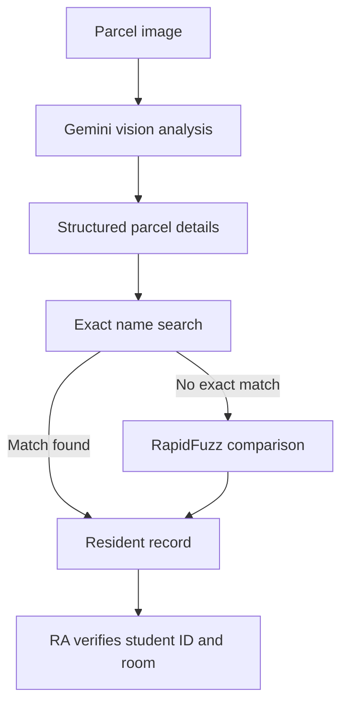

# RA Parcel Scanner

A Python prototype that reads a parcel label with the Gemini API, extracts the recipient's details as structured data, and searches a local resident directory for the most likely match.

The project is intended to reduce the time Resident Advisers spend manually identifying parcel recipients. It currently returns the matched resident's student ID and room so the RA can verify the result and continue the workflow manually in StarRez.

> **Status:** Early prototype. The scanner currently processes a saved image rather than a live camera feed.

## How it works



1. `main.py` reads a parcel image.
2. Gemini extracts the recipient name, possible room number, address, tracking number, and confidence level.
3. Pydantic validates the structured response.
4. pandas searches `residents_lookup.csv` for an exact normalized name match.
5. If no exact match exists, RapidFuzz finds the closest resident name.
6. The program displays the resident's name, student ID, room, building, and similarity score.

## Features

- Parcel-label image understanding with Gemini
- Structured output validated with Pydantic
- Exact resident-name lookup with pandas
- Fuzzy matching for small OCR or spelling differences
- Configurable similarity threshold
- Student ID, room, and building retrieval
- Manual verification before using the result

## Technology

- Python
- Google Gen AI SDK
- Gemini 3.5 Flash-Lite
- Pydantic
- pandas
- RapidFuzz

## Project structure

```text
RA-parcel-scanner/
├── main.py             # Reads the image and requests structured Gemini output
├── csv_search.py       # Searches the resident CSV and performs fuzzy matching
├── test.py             # Simple resident-search test
├── residents_lookup.csv # Local resident data; do not commit this file
└── IMG_9911.jpg        # Local test image; replace with your own safe test image
```

## Setup

### 1. Clone the repository

```bash
git clone https://github.com/Zelandini/RA-parcel-scanner.git
cd RA-parcel-scanner
```

### 2. Create a virtual environment

macOS or Linux:

```bash
python3 -m venv .venv
source .venv/bin/activate
```

Windows PowerShell:

```powershell
python -m venv .venv
.venv\Scripts\Activate.ps1
```

### 3. Install the dependencies

```bash
pip install google-genai pydantic pandas rapidfuzz
```

### 4. Configure the Gemini API key

Create a Gemini API key in [Google AI Studio](https://aistudio.google.com/app/apikey).

macOS or Linux:

```bash
export GEMINI_API_KEY="your_api_key_here"
```

Windows PowerShell:

```powershell
$env:GEMINI_API_KEY="your_api_key_here"
```

Do not place the API key directly in the source code or commit it to GitHub.

### 5. Prepare the resident lookup CSV

Create a local file named `residents_lookup.csv` in the project directory. The current search code expects these columns:

```csv
student_id,full_name,search_name,first_name,last_name,room,room_short,building
123456789,Alex Example,alex example,Alex,Example,831-105B,105B,831
```

The `search_name` value should be a normalized lowercase version of `full_name`.

### 6. Add a parcel image

Place a safe test image in the project directory and name it:

```text
IMG_9911.jpg
```

Alternatively, update the image path near the top of `main.py`.

### 7. Run the scanner

```bash
python main.py
```

Example result:

```text
Possible resident found!
Name: Alex Example
Student ID: 123456789
Room: 831-105B
Building: 831
Similarity: 96.0
```

## Resident matching

The search follows two stages:

### Exact match

The normalized name returned by Gemini is compared directly with the CSV's `search_name` column.

### Fuzzy match

If no exact match exists, `fuzz.ratio()` compares the detected name with every resident name. The current minimum similarity score is:

```python
best_score >= 85
```

A fuzzy result should always be treated as a possible match and manually verified against the parcel and resident system.

## Privacy and security

This project may process personal information, including names, addresses, student IDs, room numbers, tracking numbers, and parcel images.

- Use fake, personal, or properly authorized test data during development.
- Do not commit the real resident lookup CSV.
- Do not commit genuine parcel-label images.
- Do not commit API keys.
- Keep resident data only for as long as operationally necessary.
- Confirm that any real-world use follows university and accommodation privacy requirements.
- Always require human verification before acting on a match.

The following entries should be added to `.gitignore`:

```gitignore
.venv/
.idea/
.env
residents_lookup.csv
*.xlsx
IMG_*.jpg
__pycache__/
```

## Current limitations

- Processes one saved image at a time
- Uses a fixed local image filename
- Prints results to the terminal
- Does not yet use the detected room as a secondary matching signal
- Does not automatically open or search StarRez
- Fuzzy-match thresholds still require testing with a larger set of parcel labels
- Requires manual confirmation of every result

## Possible next steps

- Capture parcel images from a webcam
- Add automatic image cropping and sharpness checks
- Use room information to disambiguate residents with similar names
- Return the three strongest candidates instead of one
- Add a simple desktop or web interface
- Record anonymous accuracy and response-time measurements
- Add automated tests for exact and fuzzy matching
- Move configuration such as filenames and thresholds into environment variables

## Disclaimer

This is an experimental workflow-assistance tool. Its output may be incorrect and must not be treated as authoritative without human verification.
